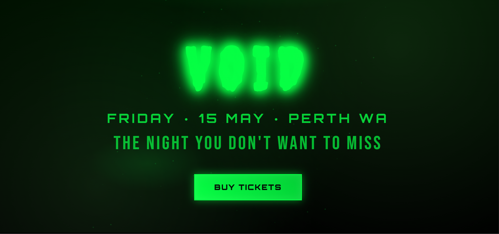
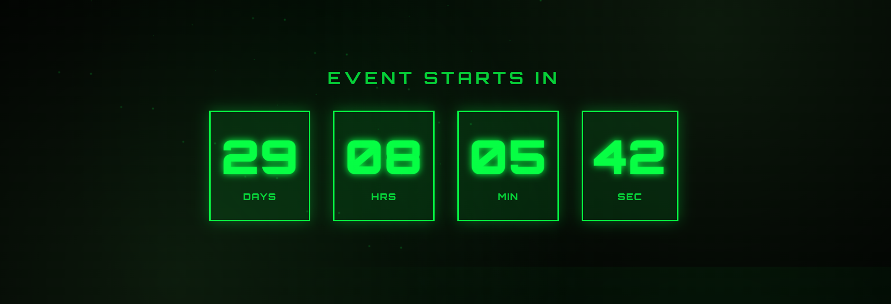
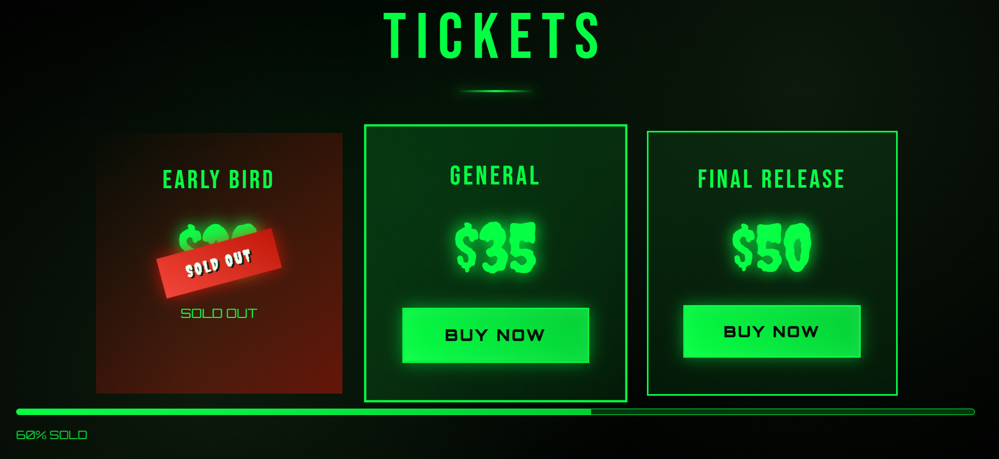

# EMBRACE THE VOID
### A conversion-focused event landing page built like a digital poster

---

> *This is not a website. It is a digital artifact of a night that feels rare, underground, and impossible to miss.*

---

## Live Preview

🔗 **[math2034.github.io/VOID](https://math2034.github.io/VOID/)**

---

## Concept

Most event websites inform. This one sells a feeling.

Inspired by underground rave flyers, screen-printed posters, and gothic aesthetics, **Embrace the Void** was built to feel like a vertical poster brought to life — raw, intense, and deliberately uncomfortable with safety.

Every design decision reinforces a single emotional goal:

> *"I need to be there."*

---

## Objective

Build a landing page that converts in under 30 seconds.

No menus. No distractions. No unnecessary content.
Just the event, the energy, and a button.

---

## Preview

| Hero | Countdown | Tickets |
|------|-----------|---------|
|  |  |  |

---

## Design Approach

### Color System
| Role | Color | Hex |
|------|-------|-----|
| Background | Pure Black | `#0D0D0D` |
| Accent | Acid Neon Green | `#BFFF00` |

Two colors only. The constraint is the identity.

### Typography
- Oversized, aggressive headlines — the text shouts, not whispers
- Monospace details for date, time, location — typewriter aesthetic
- Poster-style hierarchy throughout

### Layout Inspiration
- Screen-printed and risograph poster culture
- Grain and noise textures to simulate print imperfection

---

## Conversion Strategy

This page was engineered around one question:
**"Why should I buy this now?"**

Every element answers it:

- **Hero section** — name, date, location, and CTA visible without scrolling
- **Live countdown** — passive urgency that builds as the event approaches
- **Sold out tier** — psychological anchor that makes available tickets feel scarce
- **Social proof** — "Last 3 events sold out" before the ticket section
- **Sale notifications** — real-time urgency popups every 15–20 seconds
- **Final CTA** — last push at the bottom, impossible to scroll past

---

## Features

- Live countdown timer with critical mode under 24h
- Auto "SOLD OUT" state when event ends
- Sale notification system (stops when event ends)
- Scroll-triggered fade-in animations
- Ticket tiers with scarcity design
- Fully responsive — mobile-first
- Zero dependencies — pure HTML, CSS, JS

---

## Tech Stack

| Technology | Usage |
|------------|-------|
| HTML5 | Structure and semantic markup |
| CSS3 | Layout, animations, grain texture |
| JavaScript | Countdown logic, notifications, scroll effects |
| GitHub Pages | Deployment |

No frameworks. No libraries. No build tools.
Just the fundamentals, executed with intent.

---

## Project Structure
VOID/
├── index.html
├── css/
│   └── style.css
├── js/
│   └── script.js
└── img/
└── (crowd photos, previews)

---

## Final Statement

Anyone can build an event page.

This one was built to make people feel something before they even read the details — and act before they talk themselves out of it.

---

  Designed & developed by <a href="https://github.com/math2034">math2034</a> · 2026

